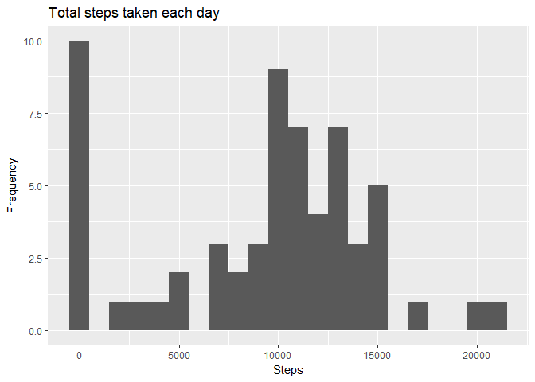
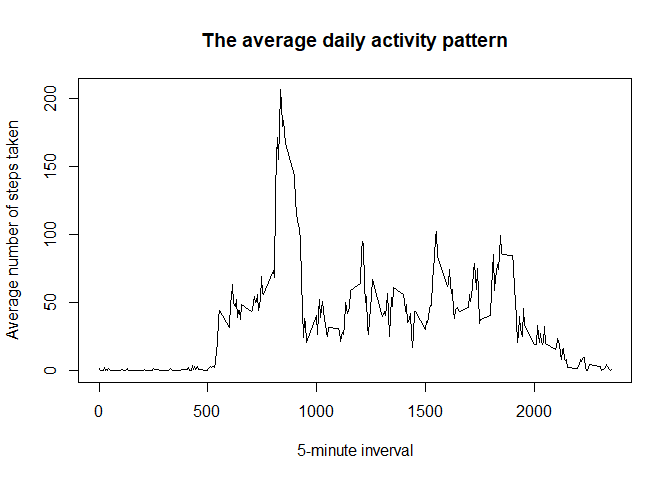
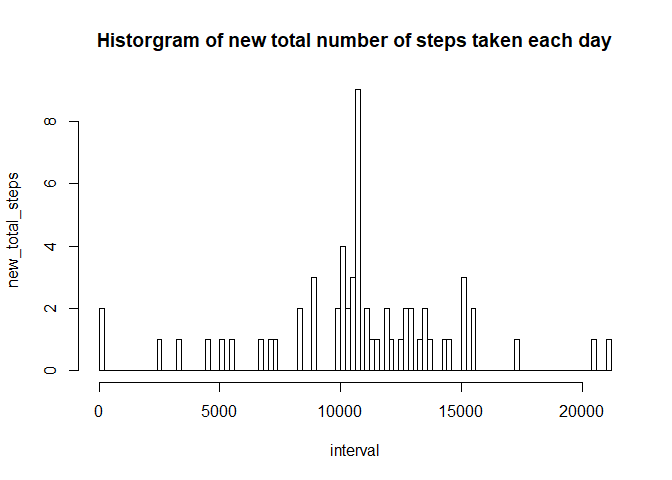
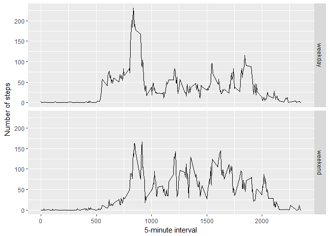

## Loading and preprocessing the data:


```r
dat_raw <- read.csv("./data/activity.csv",
                    sep = ",",
                    header = TRUE,
                    stringsAsFactors = FALSE)
```


## What is mean total number of steps taken per day?

1.Calculate the total number of steps taken per day.

```r
total_steps <- tapply(dat_raw$steps, dat_raw$date, sum, na.rm = TRUE)
print(total_steps)
```

```
## 2012-10-01 2012-10-02 2012-10-03 2012-10-04 2012-10-05 2012-10-06 
##          0        126      11352      12116      13294      15420 
## 2012-10-07 2012-10-08 2012-10-09 2012-10-10 2012-10-11 2012-10-12 
##      11015          0      12811       9900      10304      17382 
## 2012-10-13 2012-10-14 2012-10-15 2012-10-16 2012-10-17 2012-10-18 
##      12426      15098      10139      15084      13452      10056 
## 2012-10-19 2012-10-20 2012-10-21 2012-10-22 2012-10-23 2012-10-24 
##      11829      10395       8821      13460       8918       8355 
## 2012-10-25 2012-10-26 2012-10-27 2012-10-28 2012-10-29 2012-10-30 
##       2492       6778      10119      11458       5018       9819 
## 2012-10-31 2012-11-01 2012-11-02 2012-11-03 2012-11-04 2012-11-05 
##      15414          0      10600      10571          0      10439 
## 2012-11-06 2012-11-07 2012-11-08 2012-11-09 2012-11-10 2012-11-11 
##       8334      12883       3219          0          0      12608 
## 2012-11-12 2012-11-13 2012-11-14 2012-11-15 2012-11-16 2012-11-17 
##      10765       7336          0         41       5441      14339 
## 2012-11-18 2012-11-19 2012-11-20 2012-11-21 2012-11-22 2012-11-23 
##      15110       8841       4472      12787      20427      21194 
## 2012-11-24 2012-11-25 2012-11-26 2012-11-27 2012-11-28 2012-11-29 
##      14478      11834      11162      13646      10183       7047 
## 2012-11-30 
##          0
```

2.Plot Histogram of the total number of steps taken each day.

```r
library(ggplot2)
qplot(total_steps, 
      binwidth = 1000, 
      xlab = "Steps",
      ylab = "Frequency",
      main = "Total steps taken each day")
```

<!-- -->

3.Calculate the mean and median of the total number of steps taken per day.

```r
mean_val <- mean(total_steps, na.rm = TRUE)
median_val <- median(total_steps, na.rm = TRUE)
print(mean_val)
```

```
## [1] 9354.23
```

```r
print(median_val)
```

```
## [1] 10395
```

## What is the average daily activity pattern?

1.Compute the 5-minute inverval of the average number of steps taken

```r
average_steps <- aggregate(steps ~ interval, 
                           data = dat_raw, 
                           FUN = mean, 
                           na.rm = TRUE)
# look the structure of average_steps
head(average_steps, 10)
```

```
##    interval     steps
## 1         0 1.7169811
## 2         5 0.3396226
## 3        10 0.1320755
## 4        15 0.1509434
## 5        20 0.0754717
## 6        25 2.0943396
## 7        30 0.5283019
## 8        35 0.8679245
## 9        40 0.0000000
## 10       45 1.4716981
```

```r
# time series plot of the average number of steps taken.
plot(x = average_steps$interval, 
     y = average_steps$steps, 
     type = "l",
     xlab = "5-minute inverval",
     ylab = "Average number of steps taken",
     main = "The average daily activity pattern")
```

<!-- -->

2.Which 5-minute interval, on average across all the days in the dataset,  contains the maximum number of steps? 

```r
average_steps[which.max(average_steps$steps),]
```

```
##     interval    steps
## 104      835 206.1698
```

## Imputing missing values

1.calculate and report the total number of missing values in the dataset  (i.e. the total number of rows with NAs)

```r
# calculate the total number of rows with na
sum(is.na(dat_raw$steps))
```

```
## [1] 2304
```

2.Filling in all of the missing values in the dataset. Use the mean for that 5-mean interval.

```r
# construct a temp dataframe -- new_average, using average_steps
temp_average_steps <- cbind.data.frame(c(rep(average_steps$interval, 61)),
                                c(rep(average_steps$steps, 61)))

names(temp_average_steps) <- names(average_steps)

# check
dim(temp_average_steps)
```

```
## [1] 17568     2
```

```r
# check
head(temp_average_steps, 10)
```

```
##    interval     steps
## 1         0 1.7169811
## 2         5 0.3396226
## 3        10 0.1320755
## 4        15 0.1509434
## 5        20 0.0754717
## 6        25 2.0943396
## 7        30 0.5283019
## 8        35 0.8679245
## 9        40 0.0000000
## 10       45 1.4716981
```

```r
# compute the index of missing values in dataset
missing_index <- which(is.na(dat_raw$steps))
```

3.Create a new dataset that is equal to the original data but with the  missing data filled in.

```r
dat_filled <- dat_raw

# filling in missing values
dat_filled[missing_index, ]$steps <- temp_average_steps[missing_index, ]$steps

# check
head(dat_filled)
```

```
##       steps       date interval
## 1 1.7169811 2012-10-01        0
## 2 0.3396226 2012-10-01        5
## 3 0.1320755 2012-10-01       10
## 4 0.1509434 2012-10-01       15
## 5 0.0754717 2012-10-01       20
## 6 2.0943396 2012-10-01       25
```

```r
table(is.na(dat_filled$steps))
```

```
## 
## FALSE 
## 17568
```

4.Histogram of the total number of steps taken each day.

```r
# calculate the total steps of dat_filled
new_total_steps <- tapply(dat_filled$steps, dat_filled$date, sum)

# plot histogram
hist(new_total_steps,
     breaks = 100,
     xlab = "interval",
     ylab = "new_total_steps",
     main = "Historgram of new total number of steps taken each day")
```

<!-- -->

Calculate and report the mean and median new_total_steps.

```r
new_mean_val <- mean(new_total_steps, na.rm = TRUE)
new_median_val <- median(new_total_steps, na.rm = TRUE)
print(new_mean_val)
```

```
## [1] 10766.19
```

```r
print(new_median_val)
```

```
## [1] 10766.19
```

```r
print(mean_val)
```

```
## [1] 9354.23
```

```r
print(median_val)
```

```
## [1] 10395
```
### Compare the mean and median:

From above, we can see that, the values of mean and median are higher after imputing missing data.  The reason is that the missing values of original data are set to 0 before imputing missing data, therefore, the calculated mean and median of original data is smaller.

## Are there differences in activity patterns between weekdays and weekends?

1.Create a new factor variable in the dataset with two levels - "weekday" and "weekend".  Indicating whether a given date is a weekday or weekend day.

```r
# define a function to distinguish a date is weedday or weekend
weekday_or_weekend <- function(date) {
    date <- weekdays(date)
    if (date %in% c("星期一", "星期二", "星期三", "星期四", "星期五"))
        return ("weekday")
    else if (date %in% c("星期六", "星期日"))
        return ("weekend")
    else
        return (NA)
}

# add a factor variable with two level -- weekday or weekend
dat_filled$date <- as.Date(dat_filled$date)

dat_filled$day <- sapply(dat_filled$date, 
                         FUN = weekday_or_weekend)

# check
head(dat_filled)
```

```
##       steps       date interval     day
## 1 1.7169811 2012-10-01        0 weekday
## 2 0.3396226 2012-10-01        5 weekday
## 3 0.1320755 2012-10-01       10 weekday
## 4 0.1509434 2012-10-01       15 weekday
## 5 0.0754717 2012-10-01       20 weekday
## 6 2.0943396 2012-10-01       25 weekday
```

2.Make a panel plot containing a time series plot (i.e. type = "l") of the 5-minute interval(x-axis) and the average number of steps taken, averaged across all weekday days or weekend days (y-axis).

```r
new_average_steps <- aggregate(steps ~ interval + day, 
                               data = dat_filled, 
                               mean)
```

Plot by using ggplot

```r
ggplot(new_average_steps, aes(interval, steps)) + geom_line() +  facet_grid(day ~ .) + xlab("5-minute interval") + ylab("Number of steps")
```

<!-- -->

